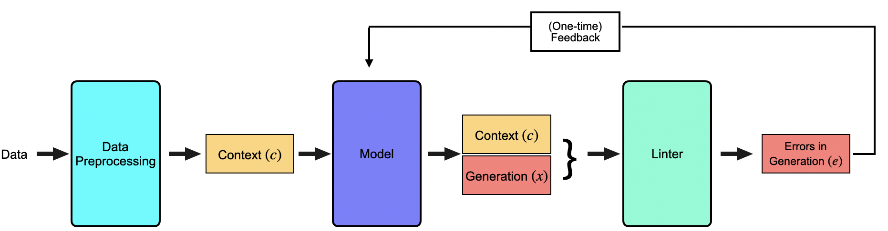

# Leveraging static analysis for evaluating code-generation models

In recent times, the utilization of Large Language Models (LLMs) for code generation has gained substantial traction. Tools such as [ChatGPT](), [GitHub CoPilot](https://github.com/features/copilot), [Code Llama](), [Bard](https://blog.google/technology/ai/bard-google-ai-search-updates/), and the pioneering work of Rozière et al. with [Code Llama]() aim to streamline developer workflows and expedite development cycles. Despite their promising prospects, code produced by these tools often suffers from bugs, hampering their overall utility. While existing methodologies primarily focus on resource-intensive runtime analysis to address these issues, research exploring static analysis, especially across a limited range of programming languages, remains scarce.

Our study aims to enrich the baseline code generation model by incorporating insights from static error analysis, potentially refining code generation quality. To achieve this objective, we introduce a pipeline that assimilates feedback gleaned from static analysis into the baseline model. Furthermore, we enhance the baseline model by fine-tuning it using samples previously rejected due to static errors. Our empirical observations underscore the efficacy of both strategies in mitigating the occurrence of observed static errors.

### Relevant links:
- [Paper presentation](https://github.com/ksanu1998/NLP_Group37/blob/main/reports/NLP_Group_37_Paper_Presentation.pdf)
- [Project proposal](https://github.com/ksanu1998/NLP_Group37/blob/main/reports/NLP_Group_37_Project_Proposal.pdf) 
- [Project status report](https://github.com/ksanu1998/NLP_Group37/blob/main/reports/NLP_Group_37_Project_Status_Report.pdf) 
- [Project presentation](https://github.com/ksanu1998/NLP_Group37/blob/main/reports/NLP_Group_37_Project_Presentation.pdf) 
- [Project final report](https://github.com/ksanu1998/NLP_Group37/blob/main/reports/NLP_Group_37_Project_Final_Report.pdf) 

### About
This repository contains code base for project titled __`Leveraging static analysis for evaluating code-generation models`__ developed during the `CSCI 544 Applied Natural Language Processing` course, Fall 2023, at the `University of Southern California` (USC).

## Pipeline


The pipeline employs automated feedback via linters (static code analyzers) to enhance error detection and improve the underlying code generation models. The multi-stage feedback pipeline is designed for effective code generation refinement.

**Pipeline Overview:**

1. **Context Generation:** The pre-processing stage generates the context as part of a prompt, incorporating text from the dataset.
2. **Code Generation:** The model utilizes the provided context along with text from the dataset to generate code.
3. **Linters Integration:** Linters are executed on the generated code to identify errors.
4. **Automated Feedback Loop:** Detected errors are then fed back in natural language as feedback into prompts for the model, enhancing subsequent code generation.

This systematic approach allows for the identification and minimization of errors within the code generation process, enabling precise insights into areas where the model might exhibit shortcomings. Importantly, it facilitates targeted corrections by providing precise information about error types and their respective locations.

> [!NOTE]  
> Highlights information that users should take into account, even when skimming.

**Fine-tuning:**

Fine-Tuning in this context seeks to elevate the baseline model's initial accuracy without necessitating subsequent feedback adjustments. This process involves refining the baseline model for code generation, specifically leveraging the DPO method. We utilize prompt construction following the same procedure as the initial stage of our feedback pipeline.

In this phase, we're utilizing quantized models for streamlined loading into the system and to facilitate running on TPUs.


## Directory Structure

| Directory               | Description                                                                                  |
|-------------------------|---------------------------------------------------------------------------------------------|
| [data](./data)          | Contains sampled raw and processed XLCoST data for training, evaluation of CodeLlama model  |
| [feedback_pipeline](./feedback_pipeline) | Notebooks for running static analysis on code generated after multiple feedback loops |
| [fine_tuning](./fine_tuning) | Notebooks for fine-tuning CodeLlama models to enhance code generation using enriched prompts |
| [linter_setup_scripts](./linter_setup_scripts) | Bash Scripts for installing, setting up, and supporting linters |
| [preprocessing](./preprocessing) | Code snippets for pre-processing and parsing in notebooks |
| [reports](./reports) | Project-related documentation and reports |
| [results](./results) | Directory storing results produced at different stages of pipelines |
| [static_analysis_pipeline](./static_analysis_pipeline) | Scripts encompassing components of static analysis pipeline for evaluating source scripts before and after feedback loops |


## Setup and Usage
### Creating a Python Virtual Environment

1. **Navigate to the Project Directory:**
    ```bash
    cd /path/to/your/project
    ```

2. **Create a Virtual Environment:**
    ```bash
    python -m venv codegenllm
    ```

3. **Activate the Virtual Environment:**
    - On Windows:
        ```bash
        codegenllm/Scripts/activate
        ```
    - On macOS and Linux:
        ```bash
        source codegenllm/bin/activate
        ```

4. **Install Project Dependencies:**
    ```bash
    pip install -r requirements.txt
    ```
    Executing this script will install the necessary libraries for code generation and linters for Python code evaluation.

### Install Linters for Static Evaluation
In case linters are not installed follow the below instructions.
1. `Flake 8` for Python
    ```bash
    cd linter_setup_scripts/flake8_utils
    chmod +x install_flake8.sh
    bash install_flake8.sh
    ```
2. `CPPCheck` for C++
    ```bash
    cd linter_setup_scripts/cppcheck_utils
    chmod +x install_cppcheck.sh
    bash install_cppcheck.sh
    ```

## Authors
1. [Sai Anuroop Kesanapalli](https://github.com/ksanu1998) | `MS in Computer Science` | `USC`
2. [Abhishek Anand](https://github.com/abhishekanand1710) | `MS in Computer Science` | `USC`
3. [Kayvan Shah](https://github.com/KayvanShah1) | `MS in Applied Data Science` | `USC`
4. [Indrani Panchangam](https://github.com/IndraniPanchangam) | `MS in Computer Science` | `USC`
5. [Vishesh Mittal](https://github.com/Vishesh-Mittal) | `MS in Computer Science` | `USC`


#### Disclaimer

<sub>
The content and code provided in this repository are for educational and demonstrative purposes only. The project may contain experimental features, and the code might not be optimized for production environments. The authors and contributors are not liable for any misuse, damages, or risks associated with the use of this code. Users are advised to review, test, and modify the code to suit their specific use cases and requirements. By using any part of this project, you agree to these terms.
</sub>


<!-- TODO:<br>
* Format the README nicely
* Explain setup guidlines for linters and LLMs (if needed)
* Explain all folders with link. Make sure to mention that the post_feedback is a proof of concept of automation. 
* Results in results/post_feedback are to demonstrate the automation and not the results of actual feedback analysis.
* Write something about LLMs that Abhishek is going to merge.
* Add author names and github handles
* Add link to final report -->
